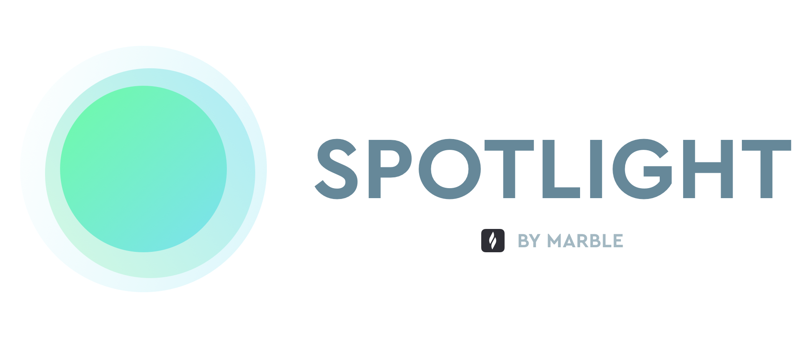

# Spotlight



> Marble's mobile scan-to-order app

## Live Links

**Production**

- <a href="https://spotlight-one.vercel.app/" target="_blank">Spotlight</a>
- <a href="https://spotlight-ui-kit.vercel.app/" target="_blank">Storybook</a>

**Staging**

- <a href="https://spotlight-git-develop.marbletech.vercel.app/" target="_blank">Spotlight</a>
- <a href="https://spotlight-ui-kit-git-develop.marbletech.vercel.app/" target="_blank">Storybook</a>

## Contributing

> Read the [Contribution Guide](CONTRIBUTING.md) to get started

## Requirements

- node (^10.0.0)
- yarn (^1.22.0)

## Setup

Install dependencies first.

```bash
yarn
```

Create a `.env.local` file copied from `.env.example`. Update values as needed. Get an access key from someone on the team.

## Running in Development

To run the app in development, run `yarn dev`.

To view the storybook, run `yarn storybook`.

## Building for production

```bash
yarn build
yarn build-storybook
```

## Deploying

`main` and `develop` branches are automatically deployed via
[Vercel](https://vercel.com/oscarnewman).
